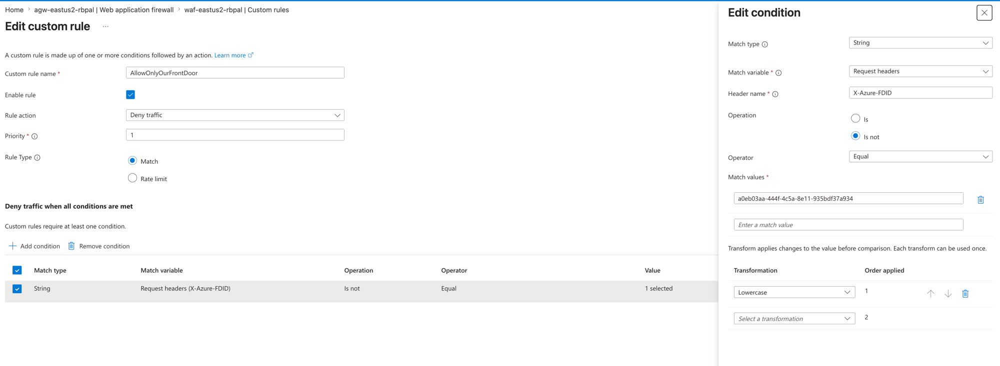
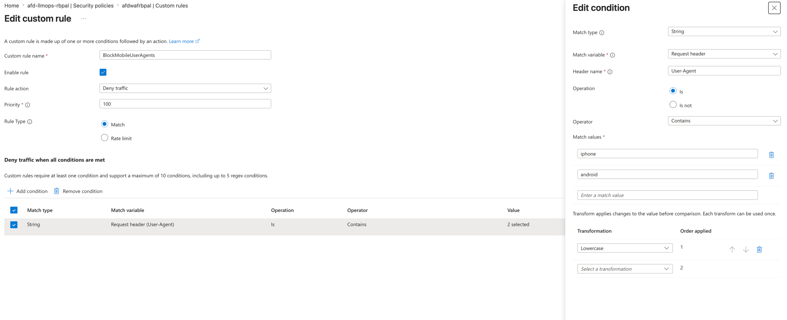

# LLMOps on AKS — Governed RAG/Agentic Assistant

A deployment + governance backbone for a non-deterministic AI system: a RAG +
agentic assistant that answers accounting/tax questions from a document corpus,
shipped to AKS through a CI pipeline whose **eval gate blocks regressions before
they reach production**. Built as a portfolio demonstrator for an MLOps/LLMOps role.

The product is the **operational machinery around the model** (eval gates, guardrails, PII
controls, audit trail, cost telemetry), not the assistant itself.

## Business problem

**Context.** An accounting / tax / advisory firm runs on expert knowledge work — staff
answering questions grounded in tax code, firm policy, and client documents. That knowledge
is scattered across thousands of documents, so senior people burn billable hours retrieving
and synthesizing information that already exists. A GenAI assistant that answers from the
firm's own documents is an obvious win — and a pilot is easy to build.

**The real problem: pilots are easy, production is not** — especially for a
*non-deterministic* system in a regulated, high-stakes domain. Shipping it is dangerous in
five specific ways:

| Risk | Why it's existential here |
| --- | --- |
| **Wrong answers** | This is tax advice. A hallucinated figure → client penalties, malpractice exposure, reputational damage. |
| **PII everywhere** | Client documents are full of SSNs and account numbers. A leak → breach notification, regulatory fines, lost trust. |
| **Non-determinism** | Same input, different output — can't be unit-tested like normal software. Quality silently regresses when a prompt or model changes. |
| **Cost blowups** | Tokens are real money; a runaway agent loop burns budget, not just CPU. |
| **No audit trail** | Regulators and clients ask "what produced this answer?" Without prompt + model versioning there is no defensible record. |

**Problem statement.** How do we ship non-deterministic GenAI to production in a
high-stakes, regulated domain — safely (no bad answers, no PII leaks), affordably (bounded,
visible cost), and auditably (every answer traceable) — and stop it from silently degrading
over time? That is the LLMOps problem this project solves.

**What "solved" delivers.**

| Capability | Business outcome |
| --- | --- |
| Eval gate (LLM-as-judge in CI) | Bad prompt/model changes are blocked before prod, automatically |
| PII tokenization + guardrails + Key Vault | Raw PII never reaches the model, vector store, or logs |
| Prompt/model registry + version+SHA logging | Every answer is traceable and auditable |
| Per-provider token/cost/latency telemetry + FinOps | Cost is visible and bounded; no surprise bills |
| AKS autoscale + governed promotion | Scales with demand; releases are controlled and reversible |

**Stakes.** A single hallucinated tax figure, leaked SSN, runaway agent, or silent quality
drift can cost more than the whole initiative saves — which is exactly why firms stall at
the pilot stage. This backbone is what lets them actually deploy.

---

## Architecture — the three data lanes

```
LANE 1 — INGESTION  (offline, run once before serving)
══════════════════════════════════════════════════════
 data/corpus/*.md            ◀── SOURCE: synthetic accounting/tax docs
        │                        (one has planted PII for the tokenization demo)
        ▼
 tokenize PII (deterministic): "123-45-6789" → "[SSN_xxxx]"  ──► VAULT (token→real)
        │                                                         (Key Vault primary)
        ▼
 chunk (~500 tok) ─► Azure OpenAI EMBEDDINGS ─► VECTOR STORE
   runtime = Azure AI Search (managed)  |  inner loop = FAISS (local)
   record = id + content + source + content_vector   (no raw PII anywhere downstream)


LANE 2 — QUERY  (online, per request, on AKS)
══════════════════════════════════════════════════════
 USER QUESTION                ◀── SOURCE: operator types it live
   ─► input guard (block injection)
   ─► domain guard (accounting/tax? else block)
   ─► embed question ─► retrieve top-k chunks ◀──► VECTOR STORE
   ─► assemble prompt (question + chunks + versioned template from registry/)
   ─► LLM CHAT via provider router (Azure OpenAI | Anthropic Claude)  [tokens only, never raw PII]
   ─► output guard (redact stray PII, off-topic)
   ─► detokenize IF authorized → real value; else keep token
   ─► ANSWER (+ [source: ...]) ─► user
        └── emits ─► telemetry: tokens, cost, latency (by provider) ─► /metrics


LANE 3 — EVAL  (used only by the CI gate, never served)
══════════════════════════════════════════════════════
 eval/golden/qa_set.yaml      ◀── SOURCE: author-written Q&A
   ─► run each question through the SAME Lane 2 path
   ─► judge (correctness/grounded) + refusal exact-match + PII-leak + off-topic
   ─► compare to thresholds.yaml ─► PASS allows deploy / FAIL blocks the PR
```

The **vector store is the hinge**: Lane 1 fills it, Lane 2 reads it, Lane 3 exercises all
of Lane 2 to grade it before anything ships.

### Network architecture — every region, CIDR & hop

The three lanes above are the *logical* view. Physically, the query lane runs on the active-active
estate below. Every address is real and taken from `infradr.auto.tfvars`; the two regions use
**non-overlapping** CIDRs on purpose — the Virtual WAN hub-to-hub mesh requires it.

| Region | Hub CIDR | VNet | appgw subnet | aks subnet | internal LB | pod / svc CIDR | hub firewall IP |
|---|---|---|---|---|---|---|---|
| **eastus2** ★ | `10.100.0.0/24` | `10.10.0.0/16` | `10.10.1.0/24` | `10.10.2.0/23` | `10.10.2.250` | `10.110.0.0/16` · `10.210.0.0/16` | `10.100.0.132` |
| **centralus** ★ | `10.200.0.0/24` | `10.20.0.0/16` | `10.20.1.0/24` | `10.20.2.0/23` | `10.20.2.250` | `10.120.0.0/16` · `10.220.0.0/16` | `10.200.0.x` |

Pod (`10.1x0/16`) and service (`10.2x0/16`) ranges are **CNI-Overlay** — off-VNet, never consume
VNet address space, never need to be non-overlapping with anything routable. DNS is `<svc>.0.10`.

```
                         public clients  →  ep-llmops-rbpal.z01.azurefd.net   (HTTPS)
                                              │
        ┌─────────────────────────────── [Azure Front Door Premium] ───────────────────────────────┐
        │ WAF DefaultRuleSet 2.1 (Prevention) · TLS terminates · origin-group og-genai · probe /healthz 30s │
        │ origin-eastus2  pri 1 / wt 1000 ★      origin-centralus pri 1 / wt 1000 ★   (50/50 active-active)  │
        │ route /*  →  injects  X-Azure-FDID = <our FDID>  on EVERY request (incl. health probes)            │
        └───────────────────────┬───────────────────────────────────────────┬──────────────────────┘
                  appgw FQDN     │ HttpOnly                        appgw FQDN │ HttpOnly
   ╔══════════════ REGION eastus2 ★ ══════════════╗   ╔══════════════ REGION centralus ★ ════════════╗
   │ pip-appgw-eastus2  →  snet-appgw 10.10.1.0/24 │   │ pip-appgw-centralus → snet-appgw 10.20.1.0/24 │
   │ ┌───────────────────────────────────────────┐│   │ ┌───────────────────────────────────────────┐│
   │ │ App Gateway WAF_v2  agw-eastus2  (1→2)     ││   │ │ App Gateway WAF_v2  agw-centralus (1→2)    ││
   │ │  listener :80 · probe GET /healthz         ││   │ │  listener :80 · probe GET /healthz         ││
   │ │  custom rule AllowOnlyOurFrontDoor (BLOCK) ││   │ │  custom rule AllowOnlyOurFrontDoor (BLOCK) ││
   │ │    if X-Azure-FDID != <our FDID> → 403     ││   │ │    if X-Azure-FDID != <our FDID> → 403     ││
   │ │  managed OWASP 3.2 (Prevention)            ││   │ │  managed OWASP 3.2 (Prevention)            ││
   │ │  rewrite +X-Served-Region: eastus2         ││   │ │  rewrite +X-Served-Region: centralus       ││
   │ └──────────────┬────────────────────────────┘│   │ └──────────────┬────────────────────────────┘│
   │   backend → internal LB 10.10.2.250 :80       │   │   backend → internal LB 10.20.2.250 :80       │
   │                ▼                               │   │                ▼                               │
   │ ┌───────────────────────────────────────────┐│   │ ┌───────────────────────────────────────────┐│
   │ │ AKS aks-eastus2   snet-aks 10.10.2.0/23    ││   │ │ AKS aks-centralus snet-aks 10.20.2.0/23    ││
   │ │  CNI Overlay · pod 10.110/16 · svc 10.210/16││   │ │  CNI Overlay · pod 10.120/16 · svc 10.220/16││
   │ │  Workload Identity (keyless AAD)           ││   │ │  Workload Identity (keyless AAD)           ││
   │ │  pod genai-api:8000  (re-checks FDID)      ││   │ │  pod genai-api:8000  (re-checks FDID)      ││
   │ │  egress: userDefinedRouting 0/0 ──┐        ││   │ │  egress: userDefinedRouting 0/0 ──┐        ││
   │ └───────────────────────────────────┼────────┘│   │ └───────────────────────────────────┼────────┘│
   │  0/0 → 10.100.0.132 (hub FW)         ▼         │   │  0/0 → hub FW (10.200.0.0/24)       ▼         │
   ╚═════════════════════════════════════╪═════════╝   ╚═════════════════════════════════════╪═════════╝
                                          ▼                                                   ▼
        [Azure Firewall afw-eastus2  AZFW_Hub]                    [Azure Firewall afw-centralus AZFW_Hub]
                                          │  routing intent: Internet + Private → firewall    │
                                          └──────────────► [Log Analytics law-afw-rbpal] ◄────┘  (every flow logged)
                                          ▲                                                   ▲
        ┌──── [Virtual WAN vwan-llmops-rbpal] ────────────────────────────────────────────────────────┐
        │  hub-eastus2 10.100.0.0/24  ◀══════════════ hub-to-hub auto-mesh ══════════════▶ hub-centralus 10.200.0.0/24 │
        │  shared firewall policy afwp-llmops-rbpal  (one policy, both firewalls)                        │
        └──────────────────────────────────────────────────────────────────────────────────────────────┘

   image supply:  ACR acrllmopsdrrbpal (Premium, geo-replicated)  →  local replica per region, AcrPull via MI
```

**How to read it:** a request enters once at Front Door (the only public name), is OWASP-scanned at
the edge, then again at whichever region's App Gateway, which refuses anything not carrying *our*
`X-Azure-FDID`. It crosses to the cluster only via the **internal** LB (`10.x.2.250`, no public IP on
the pod path), the app re-checks the FDID, and any outbound call leaves through that region's Azure
Firewall — the single, logged egress door. The two regions are symmetric and meshed privately over
the vWAN for east-west DR traffic.

---

## Active-active multi-region platform (infra-dr/)

The three lanes above run *inside* a pod; this is the active-active platform that pod runs
on, and it is the **only** deployment topology — there is no separate single-region path.
`infra-dr/` provisions the workload in **two regions at once** (`eastus2` + `centralus`),
fronted by a global Azure Front Door that splits traffic 50/50 and fails a region out on its
health probe. Flipping one origin's priority in `infradr.auto.tfvars` reverts it to
active-passive — nothing else changes.

```
client ─► AFD (WAF · TLS · /healthz LB · 50/50 weight)
       ─► region App Gateway (WAF · +X-Served-Region)  ─► AKS internal LB 10.x.2.250
       ─► Pod genai-api:8000 ─► {three lanes} ─► Azure OpenAI (egress via vWAN-hub firewall)
       ◄─ response carries the region label → proves which region served
```

| Tier | Module | Role |
|------|--------|------|
| Global edge | `frontdoor_profile` · `frontdoor_origins` | AFD Premium + WAF + origin group; the **profile is created first** so it yields the FDID, origins/route come last (they need the App Gateway FQDNs). Both origins priority 1 / weight 1000 (★ active-active 50/50) |
| Regional inbound | `appgateway` · `nsg` | App Gateway WAF_v2 on `:80`, per-region rewrite set stamps the serving region; NSG limits source to the AFD service tag **and** a WAF rule validates `X-Azure-FDID` to lock the origin to *our* Front Door |
| Compute | `aks` | Per region: AKS CNI-overlay, `userDefinedRouting` egress (explicit route table → firewall private IP), Workload Identity (keyless) |
| Transit / egress | `vwan` · `firewall` | Per region: auto-meshed hub + Azure Firewall; routing intent forces all egress through the FW. Demo uses a permissive `allow-all-egress-demo` rule but logs every flow to a Log Analytics workspace — delete the rule to restore deny-by-default |
| Image supply | `acr` | One Premium registry, geo-replicated to both regions; each cluster pulls a local replica (AcrPull via managed identity, Admin user off) |
| Observability | `observability` | Both regions feed one Azure Monitor (Prometheus) workspace + one Managed Grafana — single-pane fleet view (DCE/DCR co-located with the workspace region) |

> Status: **built, tested end-to-end, failover-proven, then torn down.** A single `terraform apply`
> in `infra-dr/` stands up **68 resources** across `eastus2` + `centralus`; the app was deployed to
> both regions, exercised through Front Door (live demo below), and a real **failover drill** was run
> (Front Door origin health eastus2 → 0%, centralus → 100%). This is the **only** topology — there is
> no single-region alternative. It carries a heavy meter (2× Azure Firewall, 2× AKS, AFD Premium), so
> it is guarded by a $200/mo budget alert and **destroyed after each exercise** (`terraform destroy`);
> re-`apply` brings it back identically.

---

## Live demo — PII-safe query through Front Door

A real request from outside Azure, all the way through the active-active topology to a keyless pod.
Maya (a tax associate) pastes a client SSN into her question — the platform strips it **before** the
model or any log ever sees it.

```bash
curl -s -X POST https://<afd-endpoint>.z02.azurefd.net/chat \
  -H "Content-Type: application/json" \
  -d '{"question": "I am filing a 1099 for contractor John Doe, SSN 123-45-6789. How long must we retain his tax records and how should they be stored?"}'
```

**What the model and request logs actually receive** (PII tokenized at the edge of the agent, before
retrieval/LLM — keyed HMAC, not reversible without the secret):

```
I am filing a 1099 for contractor John Doe, SSN [SSN_b23b]. How long must we retain his tax records ...
```

**Response (HTTP 200):**

```json
{
  "answer": "Tax returns and supporting workpapers must be retained for seven years. Records are destroyed securely after the retention period [source: 05_retention_schedule.md].",
  "sources": ["05_retention_schedule.md", "03_client_engagement_letter.md", "02_expense_reimbursement.md", "04_revenue_recognition.md"],
  "prompt":   "answer_generation v2",
  "provider": "azure_openai",
  "region":   "eastus2"
}
```

What this one call proves:

- **PII never reaches the model** — `123-45-6789` became `[SSN_b23b]` before retrieval and the LLM
  call; the answer carries no SSN. Protection is by construction (tokenize-first), not a prompt plea.
- **Keyless in production** — `provider: azure_openai` with **no API key in the cluster**; the pod got
  an AAD token via AKS Workload Identity + a federated credential on `uami-openai-rbpal`.
- **Grounded, not recalled** — the seven-year answer is cited from `05_retention_schedule.md`.
- **Active-active** — `region: eastus2` identifies which of the two origins Front Door served.
- **Origin lock** — the client sends no `X-Azure-FDID`; Front Door injects it and the App Gateway WAF
  validates it, so only *our* Front Door can reach the origin.

> Same image, prompt, and corpus as the local path — the only difference between local
> (`region: local`, API key) and cloud (`region: eastus2`, keyless) is **how the code authenticated**.

### Active-active load balancing — proven

With the app deployed to **both** regions, Front Door weight-splits traffic across the two origins.
Twenty identical requests through the AFD endpoint, from the recorded run:

```
$ for i in $(seq 1 20); do curl -s .../chat -d '{"question":"..."}' | jq -r .region; done | sort | uniq -c
  12 centralus
   8 eastus2
```

A **12 / 8** split — the `region` field in each response (stamped per region by the App Gateway
rewrite as `X-Served-Region`) is the proof of *which* origin served it, so a response tagged
`eastus2` could only have come via the eastus2 gateway. With 20 calls against an even weight, the
ratio varies around 50/50 by chance — 12/8 is exactly the kind of small-sample spread you expect;
the point is that **both** origins served real traffic concurrently. Failover is the same mechanism:
delete one region's deployment and its App Gateway origin goes
unhealthy on the AFD health probe, so all traffic shifts to the survivor (flip an origin's priority
in `infradr.auto.tfvars` to switch to active-passive instead).

The 50/50 split is configured at the Front Door origin group — **both** origins set to
**Priority 1 / Weight 1000**, which is exactly what makes the load balancing active-active rather
than active-passive:

**`origin-eastus2` — Priority 1, Weight 1000:**


**`origin-centralus` — Priority 1, Weight 1000:**


Equal priority means Front Door treats both as primary; equal weight means it splits evenly. Set
`origin-centralus` to **Priority 2** and the same group becomes active-passive — centralus only
takes traffic when eastus2 is unhealthy.

### Failover — tested live, end to end

I ran a real failover against the running estate. The kill was **non-destructive** — I scaled the
eastus2 `genai-api` Deployment to **0 replicas** (infrastructure untouched), so no pod answers
`GET /healthz`. Health probes then take the region out of rotation with **no config change, no DNS
edit, no Terraform**:

```
# 1. BASELINE — both regions live (20 calls through Front Door)
       12 centralus · 8 eastus2                    # ≈ 50/50 by weight

# 2. KILL eastus2 (reversible — scale to zero, do NOT delete)
   kubectl --context aks-eastus2-rbpal -n prod scale deployment genai-api --replicas=0

# 3. ~100s later, after the probes converge
       18 centralus · 0 eastus2                    # 100% shifted, 0 errors in steady state

# 4. RESTORE
   kubectl --context aks-eastus2-rbpal -n prod scale deployment genai-api --replicas=1
       18 centralus · 2 eastus2  → rebalances back to 50/50 as probes recover
```

**Why it works — a two-layer health-probe cascade.** Nothing is manual; two independent probes,
both hitting the app's real `/healthz`, do the work:

| Layer | Probe | Cadence | Marks region down after |
|---|---|---|---|
| **Regional** — App Gateway | `probe-healthz` → `GET /healthz` on internal LB `10.10.2.250` | 30 s interval, `200–399` | 3 consecutive failures (~90 s) |
| **Global** — Front Door | origin-group probe → `GET /healthz` per origin | 30 s | drops origin from `og-genai` once unhealthy |

The App Gateway sees its backend pool go empty first; Front Door's own probe then fails the whole
eastus2 origin and routes 100% to centralus. Convergence in this run was **~100 s** end to end.

**Proof — Front Door origin health during the failover:**


*Front Door → Metrics → `Origin Health Percentage`, split by origin.* The **pink** line is
`origin-eastus2`, the **blue** line is `origin-centralus`. Each time eastus2's `genai-api` is scaled
to zero, its origin health plunges to **0%** while centralus stays pinned at **100%** — then climbs
straight back when the deployment is restored. Two troughs = two drills (kill → recover → kill).
The legend's eastus2 average (**56.68%**) is dragged down precisely *because* of those outages,
while centralus reads **99.35%**. This is the failover, detected and acted on by the probe — no human,
no DNS change.

**RTO / RPO for this design:**

| Metric | Value | Why |
|---|---|---|
| **RTO** (recovery time) | **~100 s, automatic** | probe cascade above; no human, no DNS TTL (Front Door is anycast, not DNS-based) |
| **RPO** (data loss) | **≈ 0** | the app is **stateless** — RAG index is baked into the image, no per-region database to replicate; an in-flight request may fail once and is safely retried |
| **Failover trigger** | health-driven | `/healthz` going dark, not a manual switch |
| **Blast radius of one region** | 0% of capacity lost (to the user) | the survivor already runs hot at full size and absorbs 100% |

**Active-active vs active-passive — the trade-off this build makes:**

| | Active-active (built) | Active-passive (one flag away) |
|---|---|---|
| Origins | both Priority 1 / Weight 1000 → 50/50 | survivor Priority 1, standby Priority 2 |
| Steady-state cost | **2× compute always on** | standby can be smaller/scaled-down |
| RTO | lowest — standby already serving | higher — cold/warm start on the standby |
| Capacity headroom needed | each region must hold **100%** of load alone | same, if standby is full-size |
| Switch | — | set `centralus` origin `priority = 2` in `infradr.auto.tfvars` |

**What this test did *not* prove (honest scope).** Scale-to-zero simulates *app* failure in a
region, not a *full* regional outage (control plane, AZ, or network partition). It also doesn't
exercise stateful replication — there is no database here by design (stateless RAG), so there's
nothing to fail over. A complete DR drill would also kill at the infrastructure layer (e.g. an NSG
deny or node-pool stop) and measure a real region's control-plane loss.

### Edge WAF — managed + custom rules

The Front Door WAF runs the **Microsoft DefaultRuleSet 2.1** (189 managed OWASP rules, Block-on-
Anomaly) plus a **custom rule** authored in Terraform (`BlockMobileUserAgents`) configured to block
mobile clients at the edge by `User-Agent`. The rule's **defined behaviour**:

```
normal client                                                 → 200
User-Agent: Mozilla/5.0 (iPhone; CPU iPhone OS 17_0 ...)      → 403   (expected: blocked at AFD)
User-Agent: Mozilla/5.0 (Linux; Android 14; Pixel 8)         → 403   (expected: blocked at AFD)
```

When it blocks, it blocks at Front Door — the request never reaches an App Gateway, a cluster, or
the model.

> **Status: configured, not yet evidenced on the live estate.** The rule *is* in place — see the
> portal screenshot in the [Security](#security--defense-in-depth) section — so the **configuration**
> is proven. The `403`s above are the rule's intended behaviour, not a captured run. A behavioural
> capture (a real `curl` returning `403` through Front Door) is a pending to-do.

---

## Security — defense in depth

Security is layered so that no single control is load-bearing: the edge, the regional ingress, the
network, the identity plane, and the egress path each remove a different class of attack. A request
has to clear all of them before it reaches the model, and the cluster can only talk back out through
one audited door. Every control below is declared in Terraform — there is no click-ops drift.

| # | Layer | Control | What it stops |
|---|-------|---------|---------------|
| 1 | **Global edge** | Front Door WAF — `Microsoft_DefaultRuleSet 2.1`, **Prevention/Block** mode + TLS termination at the anycast edge | OWASP top-10 (SQLi, XSS, RFI…) dropped before any traffic enters a region; HTTPS enforced at the closest PoP |
| 2 | **Regional ingress** | App Gateway WAF_v2 — managed **OWASP 3.2** in **Prevention** mode | second, independent OWASP pass per region (edge bypass ≠ free pass) |
| 3 | **Origin lock-down** | App Gateway custom rule `AllowOnlyOurFrontDoor` (priority 1, Block) — denies any request whose `X-Azure-FDID` header ≠ our profile's FDID | someone pointing **their own** Front Door at our public origin FQDN — the shared `AzureFrontDoor.Backend` service tag is narrowed to *only our* AFD |
| 4 | **App-layer re-check** | pods carry `EXPECTED_FDID`; the app itself rejects `/chat` whose `X-Azure-FDID` mismatches | defense-in-depth — the origin lock is enforced again *inside* the app, not only at the gateway |
| 5 | **Network segmentation** | NSG on every subnet; App Gateway subnet allows only `GatewayManager` (65200-65535), `AzureLoadBalancer` probes, and `AzureFrontDoor.Backend` on 80/443 — all else implicitly denied | lateral/inbound reach to the ingress subnet from anywhere but the gateway control plane and our edge |
| 6 | **Keyless identity** | AKS Workload Identity (OIDC issuer + federated credential on `uami-openai-rbpal`); the app calls Azure OpenAI via **AAD token, no API key anywhere** | leaked/committed API keys — there are none to leak; rotation is automatic via AAD |
| 7 | **Registry identity** | ACR `admin_enabled = false`; kubelet pulls via the **AcrPull** role on a managed identity | registry username/password sprawl; only the cluster's own identity can pull |
| 8 | **Least-privilege RBAC** | each AKS identity gets `Network Contributor` scoped to **its own spoke VNet only** | a compromised cluster identity reaching beyond its region's network |
| 9 | **Egress control** | AKS `outbound_type = userDefinedRouting` → `0.0.0.0/0` next hop is the **Azure Firewall** private IP; every flow is logged to Log Analytics | silent data exfiltration / unaudited outbound — the cluster has exactly one way out and it is recorded |
| 10 | **Secrets** | Azure Key Vault is the primary store (encrypted-file fallback); `*.tfvars`, `.env`, state files all gitignored | secrets in source control or container images |

**Why two WAFs (edge + regional)?** The edge WAF is cheap and global — it sheds volumetric and
generic attacks before they cost a region anything. The App Gateway WAF is the backstop: if a rule
is tuned looser at the edge, or an attacker reaches the origin FQDN directly, the regional WAF +
the `X-Azure-FDID` lock still stand. Bypassing one does not bypass the other.

**Origin lock-down via `X-Azure-FDID`.** An origin behind Front Door is reachable on a public FQDN,
and the `AzureFrontDoor.Backend` service tag that the NSG admits is shared by *every* tenant's Front
Door. On its own, that means a third party could provision their own Front Door, point it at our
origin, and pass the NSG check. The App Gateway WAF custom rule `AllowOnlyOurFrontDoor` closes that
gap: it requires the `X-Azure-FDID` header — which Front Door injects on every request and a client
cannot forge end-to-end — to equal *our* profile's GUID, so only **our** Front Door is accepted as a
valid origin caller. The application re-validates the same header before serving `/chat`, so the
control holds even if the gateway rule were misconfigured.



*App Gateway WAF policy `waf-eastus2-rbpal` → custom rule `AllowOnlyOurFrontDoor` (priority 1,
**Deny traffic**). The condition matches `Request headers → X-Azure-FDID` with **Is not Equal** to
our Front Door's GUID, with a Lowercase transform so the GUID comparison is case-insensitive. Any
request whose header is absent or does not match is blocked before it reaches the cluster.*

**Application-layer policy by header filtering — the mobile-client block.** Because a WAF operates
at **Layer 7**, a custom rule can match on any part of an HTTP request — method, URI, query string,
cookies, body, or any header — and apply an action (Allow / Block / Log / rate-limit). That makes the
WAF a place to express *application policy*, not only attack signatures. The Front Door rule
`BlockMobileUserAgents` is an example: it inspects the `User-Agent` request header and denies the
request at the global edge when it contains `iphone` or `android` (a Lowercase transform makes the
match case-insensitive), so a mobile client is turned away at the nearest PoP before any region is
involved.



*Front Door WAF policy `afdwafrbpal` → custom rule `BlockMobileUserAgents` (priority 100, **Deny
traffic**). Condition: `Request header → User-Agent` **Contains** `iphone` or `android`, Lowercase
transform — evaluated at the global edge.*

> **Important — this is steering policy, not a security boundary.** `User-Agent` is set by the
> client and is trivially spoofable, so this rule is a way to *route or refuse* a class of client
> (e.g. push mobile users to a dedicated app), not to authenticate anyone. It demonstrates how L7
> header filtering is authored; the `X-Azure-FDID` rule above uses the *same* mechanism for a control
> that **is** meaningful, precisely because that header is injected by Front Door, not the client.

**Where each filter sits — L7 vs L3/L4.** It is worth being precise about layers, because the WAF
and the NSG/firewall are not interchangeable:

| Layer | Component (this build) | Inspects | Example here |
|---|---|---|---|
| **L3 / L4** (network) | **NSG** on each subnet | source/dest **IP & CIDR** (service tags), **ports**, protocol — stateless, no HTTP awareness | admit only `AzureFrontDoor.Backend` on TCP 80/443; deny all else |
| **L3 / L4 + FQDN** | **Azure Firewall** (egress) | network rules (IP/port) plus application rules (FQDN) | AKS egress to the `AzureKubernetesService` FQDN tag, `AzureCloud`, DNS/NTP |
| **L7** (HTTP) | **Front Door WAF + App Gateway WAF** | HTTP **headers, URI, body, cookies, method**; managed OWASP signatures | `User-Agent` block, `X-Azure-FDID` lock, OWASP rule sets |

A WAF is an L7 service: it only sees a request *after* TLS termination and HTTP parsing, so it can
reason about the application protocol (headers, paths, payloads). The NSG and the firewall's network
rules work **below** that, on the IP/port 5-tuple, and never read the payload — they drop a
disallowed source before the HTTP engine is ever reached. The two layers compose: the NSG narrows
*who* can open a connection (only Azure Front Door's backend range), and the WAF then decides *what*
that connection is allowed to ask for.

One nuance for completeness: Azure WAF custom rules can *also* match on the client IP (`RemoteAddr` /
`SocketAddr`) and on geography (`GeoMatch`), so an IP- or country-based allow/deny **can** be
expressed inside the WAF. That is an L3 *attribute* being evaluated by the L7 engine — useful, but
distinct from a true stateless L3/L4 filter. Coarse network filtering belongs on the NSG and the
firewall; HTTP-aware policy belongs on the WAF.

**Honest scope — what is demo-grade, not production-hardened.** Two controls are deliberately
teaching-grade and labelled as such in Terraform: (1) the edge `BlockMobileUserAgents` rule keys on
`User-Agent`, which is trivially spoofable — it demonstrates *how* a WAF custom rule is authored, it
is not a real access control; (2) the firewall ships a permissive `allow-all-egress-demo` rule so
nothing fails silently at AKS bootstrap — it stays **in-path and logs every flow**, and deleting
that one rule restores deny-by-default against the curated AKS egress allow-list (`AzureKubernetesService`
FQDN tag, `AzureCloud`, DNS/NTP) that sits beneath it. Origin traffic between Front Door and the App
Gateway runs on `:80` (the FDID lock, not mTLS, is the origin trust boundary) — a production build
would add end-to-end TLS to the origin.

---

## Observability — one Grafana, both regions

Both clusters scrape into a single Azure Monitor workspace (`amw-llmops-dr-rbpal`) rendered in one
Managed Grafana. The **Fleet View** shows `aks-eastus2-rbpal` and `aks-centralus-rbpal` on the same
panels (traffic, drops, per-node) — a single pane for the whole fleet. Per-region drill-downs give
egress/ingress bytes & packets and a drops-by-reason breakdown.

**eastus2 cluster (`aks-eastus2-rbpal`) — Network Observability:**


**centralus cluster (`aks-centralus-rbpal`) — Network Observability:**


Same dashboard, same Grafana instance — only the cluster selector changes. Egress/ingress bytes
and packets per second confirm both regions are live and serving in parallel (active-active), not
one hot and one cold.

> The clean, unambiguous failover proof is the **Front Door Origin Health** chart in the failover
> section above (eastus2 → 0%, centralus → 100%). On the cluster-network dashboards the same kill
> appears only *indirectly* — as a connection-drop spike, since the node stays up when just the pod
> is scaled to zero — so it isn't used here as the failover evidence.

---

## What it shows
- **Eval gate as a deploy gate** — golden set + LLM-as-judge scoring correctness,
  groundedness, refusal rate, and PII leakage; a failing score blocks the merge.
- **Prompt + config as versioned artifacts** — prompts in git; every answer logs
  prompt name + version + git SHA (auditable "what was running when").
- **PII tokenization with a vault** — SSNs/account numbers are tokenized at
  ingestion, so the model, vector store, and logs never see real values;
  authorized reads detokenize on the way out.
- **Managed vector store** — Azure AI Search (Free tier) at runtime; FAISS for the
  local inner loop; both behind one interface, swapped by config.
- **AKS with 1->3 node autoscaling**, deployed via Terraform modules.
- **Azure-native observability** — the app emits tokens, cost, latency, and failure
  metrics in Prometheus format; **Azure Monitor Managed Prometheus** scrapes them on
  AKS and **Azure Managed Grafana** visualizes them (both provisioned in Terraform).

---

## How the eval gate works

You can't unit-test an LLM — the same input gives a different output, so a prompt tweak or model
bump can silently degrade answers, leak PII, or stop refusing off-topic questions. The eval is the
regression test for that: a behavioural suite, wired into CI as a **deploy gate**.

**1. Golden set** (`eval/golden/qa_set.yaml`) — 12 hand-written Q&A across four categories:

| Category | What it probes |
|---|---|
| `in_corpus` (6) | correct answer to a real corpus question, citing the right source file |
| `pii` (2) | tokenizes / refuses instead of exposing a planted SSN or account number |
| `off_topic` (4) | the domain guard refuses ("what's the weather?") |
| `refusal` (0 here) | exact-match refusal text — slot exists, no items yet |

**2. Real path, not a mock** — each item is run through `app.agent.answer()`, the *same* pipeline
prod serves (guards → retrieve → versioned prompt → LLM → PII scrub). The eval grades actual
shipping behaviour.

**3. Hybrid scoring** — the model judges only what a string match can't:

| Metric | Scored by |
|---|---|
| `correctness`, `grounded` | **LLM-as-judge** (`temperature=0`) for semantics — *grounded* also requires the expected source to be cited |
| `pii_leak`, `off_topic_block`, `refusal_rate` | **deterministic** checks (literal match / refusal marker) — safety properties must be reliable, not a judge's opinion |

**4. The gate** (`eval/thresholds.yaml`) — `gate()` exits nonzero on any breach, which fails CI and
blocks the deploy:

```
correctness_min      0.70     # quality floor (a soft minimum)
grounded_min         0.90
off_topic_block_min  1.00     # safety: must block 100% of off-topic
refusal_rate_min     1.00
pii_leak_max         0.00     # safety: ZERO tolerance — one leak fails the build
```

Quality is a *floor*; safety (PII, off-topic) is *absolute*. A bad prompt or model change fails the
build instead of silently degrading production.

---

## Trade-offs — this is a lab/demo, and that drove real decisions

This is a learning build, not a production estate. Several choices were made *for* the lab — to
prove a concept, keep the bill survivable, or keep the moving parts teachable. Each one is a
conscious trade-off with a known production alternative, not an oversight.

| Decision | What I chose (lab) | Production alternative | Why the lab choice is fine here |
|---|---|---|---|
| **Lifecycle** | `apply` → demo → `destroy` after every exercise | always-on, blue/green deploys | the meter is heavy (2× Firewall, 2× AKS, AFD Premium); tearing down = **$0 idle**, and `apply` rebuilds it identically. Cost of the choice: no persistent URL, ~cold rebuild each time |
| **Topology** | full **active-active** (both regions hot, 50/50) | active-passive, or A/A scaled to real traffic | A/A is the *point* of the demo — it proves 50/50 + zero-RTO failover. Production might pick active-passive (cheaper standby) — it's literally **one priority flag** away |
| **Failover test** | scale `genai-api` to **0 replicas** (app failure) | kill at the infra layer (AZ, control plane, region) | scale-to-zero is reversible, fast, and free to repeat; it proves the *probe→reroute* path. It does **not** prove a full regional/control-plane outage |
| **Egress** | permissive `allow-all-egress-demo` rule, but **in-path + fully logged** | delete that rule → deny-by-default against the curated allow-list | nothing fails silently at AKS bootstrap during a live demo; the firewall still records every flow so you can *see* what to tighten. One rule deletion hardens it |
| **Origin trust** | Front Door → App Gateway on `:80`, locked by `X-Azure-FDID` | end-to-end TLS / mTLS to the origin | the FDID header lock is the trust boundary and is enough to demonstrate origin lock-down; e2e TLS is the production add |
| **Edge mobile rule** | `BlockMobileUserAgents` on `User-Agent` | real client attestation / device posture | it teaches *how* a WAF custom rule is authored; `User-Agent` is trivially spoofable and is **not** a real control (labelled as such in TF) |
| **State** | **stateless** app, FAISS index baked into the image | external vector store + per-user history datastore | statelessness makes RPO≈0 trivial (nothing to replicate) and DR clean — at the cost of no conversation history and a rebuild-to-update corpus |
| **Observability HA** | **one** Prometheus + Grafana (single region) | per-region monitoring or a global aggregator | one workspace = clean single-pane fleet view for a demo; it is itself a regional dependency (lose that region, lose live dashboards) |
| **Scale** | golden set + small finance corpus, AKS 1→3 nodes | production eval volume, larger node pools, PrivateLink origins | enough to exercise the eval gate, autoscaling, and routing without paying for scale the demo never uses |
| **Tenancy** | single subscription / single tenant | separate subs per environment for blast-radius isolation | fine for a personal lab; a real org would isolate prod from non-prod at the subscription boundary |

**The through-line:** where the lab and production diverge, the lab optimises for **cost,
reversibility, and teachability**, and every divergence is one well-marked switch away from the
harder choice — delete a rule for deny-by-default, flip a priority for active-passive, add a
datastore for state. The architecture is production-shaped; the *settings* are dialled to demo.

---

## Quickstart
```bash
# install uv if needed: curl -LsSf https://astral.sh/uv/install.sh | sh
make venv                 # uv sync — creates .venv, installs from pyproject.toml
cp .env.example .env      # fill in Foundry endpoint/key/deployments
make smoke-foundry        # verify Azure OpenAI works
make smoke-kind           # verify local cluster
make ingest               # build PII-free vector index (VECTOR_STORE=faiss locally)
make run                  # serve locally on :8000
make eval                 # run the eval gate
```


---

## Stack
FastAPI + (LangGraph) agent · Azure AI Search (FAISS local fallback) · Azure OpenAI
(Foundry: gpt-4o-mini + text-embedding-3-small) · uv · Docker · kind (local) / AKS (cloud) ·
kustomize · Terraform (azurerm) · GitHub Actions · Azure Monitor Managed Prometheus + Managed Grafana.

---

## Build plan

The build arc, as `step_XX_taskYY` milestones with per-task acceptance checks. Steps 00–06 build
and harden the **application**; 07–08 stand up, prove, and tear down the **platform**. (This is the
shipped state — deployed, failover-tested, and torn down — not a skeleton to fill.)

- **step_00** Bootstrap & smoke tests (venv, Foundry, kind, terraform validate)
- **step_01** Spine: FastAPI + config + LLM router (Azure OpenAI **keyless via AAD** + Anthropic) + RAG + agent
- **step_02** PII tokenization + vault (Key Vault primary)
- **step_03** Containerize + 3 namespaces on kind
- **step_04** Eval gate (LLM-as-judge) — the centerpiece; CI blocks regressions
- **step_05** Guardrails + prompt registry audit + CD promotion
- **step_06** Observability — Azure-native Prometheus + Grafana, per-provider + cost
- **step_07** Active-active multi-region platform (`infra-dr/`) — the **only** topology. Global Front
  Door Premium (WAF DefaultRuleSet 2.1, TLS, two **50/50 weighted** origins) over `eastus2` +
  `centralus`, each region = App Gateway WAF_v2 (managed OWASP 3.2 + `AllowOnlyOurFrontDoor`
  `X-Azure-FDID` origin lock + `BlockMobileUserAgents`) → AKS (CNI-overlay, 1→3 autoscale,
  **keyless Workload Identity** to Azure OpenAI) → Azure Firewall via vWAN routing intent (all egress
  logged to Log Analytics). Geo-replicated Premium ACR, one Prometheus + Grafana fleet view.
  **Failover proven live**: scale-to-zero → AFD origin health `eastus2 → 0%` / `centralus → 100%`,
  **RTO ~100 s / RPO ~0**.
- **step_08** Teardown (`terraform destroy`) — the A/A meter is heavy (2× Firewall, 2× AKS, AFD
  Premium), so the estate is destroyed after each exercise and re-applied identically; nothing is
  left running.

The system runs as three data lanes — **Ingestion** (corpus → tokenize PII → chunk →
embed → vector store), **Query** (guards → retrieve → assemble versioned prompt → LLM
router → guards → detokenize → answer + telemetry), and **Eval** (golden Q&A through the
same query path → judge + checks → thresholds gate the deploy). Key decisions: Azure Key
Vault for secrets/PII, multi-provider LLM router (Azure OpenAI + Anthropic Claude), Azure
AI Search + FAISS behind one interface, Azure-native Prometheus + Grafana.
