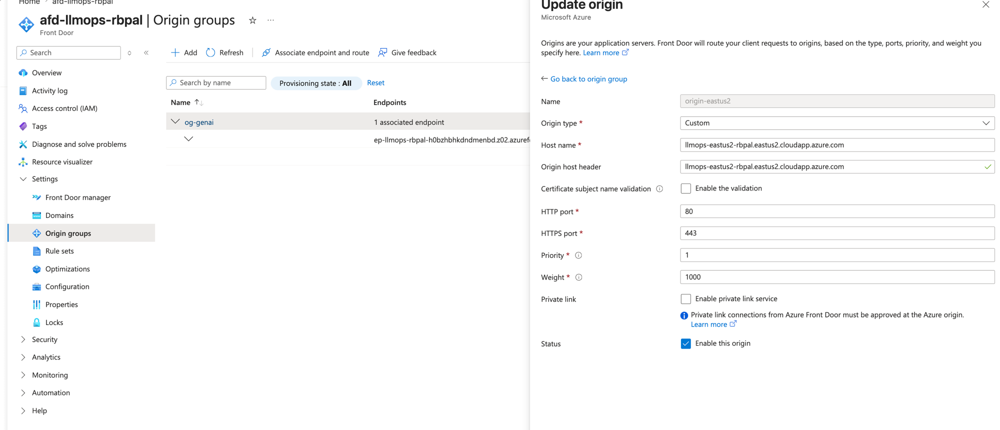
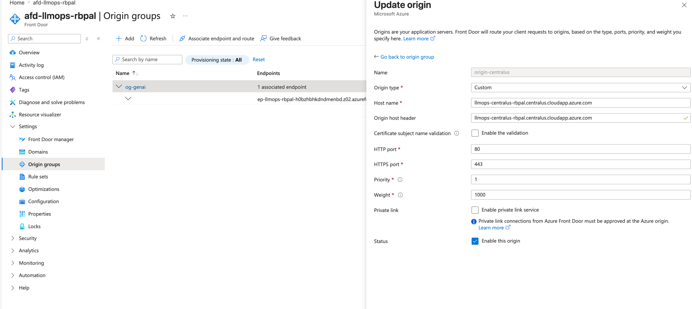
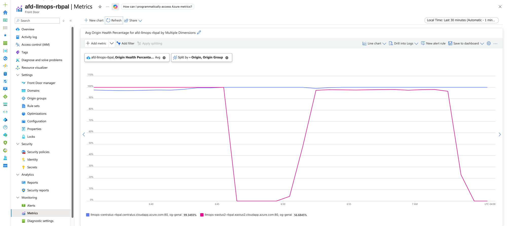
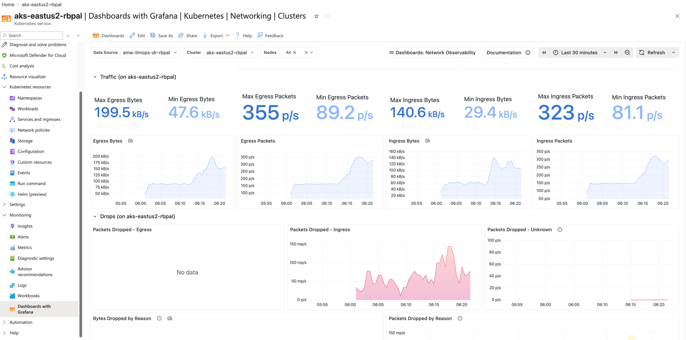
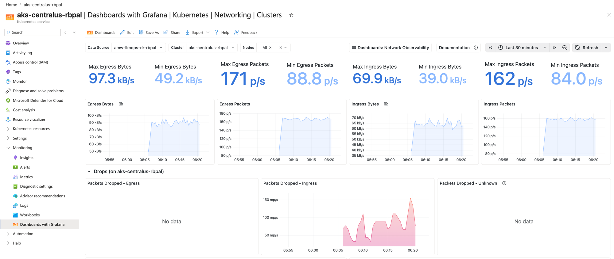

# LLMOps on AKS — Governed RAG/Agentic Assistant

A deployment + governance backbone for a non-deterministic AI system: a RAG +
agentic assistant that answers accounting/tax questions from a document corpus,
shipped to AKS through a CI pipeline whose **eval gate blocks regressions before
they reach production**. Built as a portfolio demonstrator for an MLOps/LLMOps role.

The product is the **operational machinery around the model** (eval gates, guardrails, PII
controls, audit trail, cost telemetry), not the assistant itself.

## Business problem

**Context.** An accounting / tax / advisory firm runs on expert knowledge work — staff
answering questions grounded in tax code, firm policy, and client documents. That knowledge
is scattered across thousands of documents, so senior people burn billable hours retrieving
and synthesizing information that already exists. A GenAI assistant that answers from the
firm's own documents is an obvious win — and a pilot is easy to build.

**The real problem: pilots are easy, production is not** — especially for a
*non-deterministic* system in a regulated, high-stakes domain. Shipping it is dangerous in
five specific ways:

| Risk | Why it's existential here |
| --- | --- |
| **Wrong answers** | This is tax advice. A hallucinated figure → client penalties, malpractice exposure, reputational damage. |
| **PII everywhere** | Client documents are full of SSNs and account numbers. A leak → breach notification, regulatory fines, lost trust. |
| **Non-determinism** | Same input, different output — can't be unit-tested like normal software. Quality silently regresses when a prompt or model changes. |
| **Cost blowups** | Tokens are real money; a runaway agent loop burns budget, not just CPU. |
| **No audit trail** | Regulators and clients ask "what produced this answer?" Without prompt + model versioning there is no defensible record. |

**Problem statement.** How do we ship non-deterministic GenAI to production in a
high-stakes, regulated domain — safely (no bad answers, no PII leaks), affordably (bounded,
visible cost), and auditably (every answer traceable) — and stop it from silently degrading
over time? That is the LLMOps problem this project solves.

**What "solved" delivers.**

| Capability | Business outcome |
| --- | --- |
| Eval gate (LLM-as-judge in CI) | Bad prompt/model changes are blocked before prod, automatically |
| PII tokenization + guardrails + Key Vault | Raw PII never reaches the model, vector store, or logs |
| Prompt/model registry + version+SHA logging | Every answer is traceable and auditable |
| Per-provider token/cost/latency telemetry + FinOps | Cost is visible and bounded; no surprise bills |
| AKS autoscale + governed promotion | Scales with demand; releases are controlled and reversible |

**Stakes.** A single hallucinated tax figure, leaked SSN, runaway agent, or silent quality
drift can cost more than the whole initiative saves — which is exactly why firms stall at
the pilot stage. This backbone is what lets them actually deploy.

## Architecture — the three data lanes

```
LANE 1 — INGESTION  (offline, run once before serving)
══════════════════════════════════════════════════════
 data/corpus/*.md            ◀── SOURCE: synthetic accounting/tax docs
        │                        (one has planted PII for the tokenization demo)
        ▼
 tokenize PII (deterministic): "123-45-6789" → "[SSN_xxxx]"  ──► VAULT (token→real)
        │                                                         (Key Vault primary)
        ▼
 chunk (~500 tok) ─► Azure OpenAI EMBEDDINGS ─► VECTOR STORE
   runtime = Azure AI Search (managed)  |  inner loop = FAISS (local)
   record = id + content + source + content_vector   (no raw PII anywhere downstream)


LANE 2 — QUERY  (online, per request, on AKS)
══════════════════════════════════════════════════════
 USER QUESTION                ◀── SOURCE: operator types it live
   ─► input guard (block injection)
   ─► domain guard (accounting/tax? else block)
   ─► embed question ─► retrieve top-k chunks ◀──► VECTOR STORE
   ─► assemble prompt (question + chunks + versioned template from registry/)
   ─► LLM CHAT via provider router (Azure OpenAI | Anthropic Claude)  [tokens only, never raw PII]
   ─► output guard (redact stray PII, off-topic)
   ─► detokenize IF authorized → real value; else keep token
   ─► ANSWER (+ [source: ...]) ─► user
        └── emits ─► telemetry: tokens, cost, latency (by provider) ─► /metrics


LANE 3 — EVAL  (used only by the CI gate, never served)
══════════════════════════════════════════════════════
 eval/golden/qa_set.yaml      ◀── SOURCE: author-written Q&A
   ─► run each question through the SAME Lane 2 path
   ─► judge (correctness/grounded) + refusal exact-match + PII-leak + off-topic
   ─► compare to thresholds.yaml ─► PASS allows deploy / FAIL blocks the PR
```

The **vector store is the hinge**: Lane 1 fills it, Lane 2 reads it, Lane 3 exercises all
of Lane 2 to grade it before anything ships.

## Active-active multi-region platform (infra-dr/)

The three lanes above run *inside* a pod; this is the active-active platform that pod runs
on, and it is the **only** deployment topology — there is no separate single-region path.
`infra-dr/` provisions the workload in **two regions at once** (`eastus2` + `centralus`),
fronted by a global Azure Front Door that splits traffic 50/50 and fails a region out on its
health probe. Flipping one origin's priority in `infradr.auto.tfvars` reverts it to
active-passive — nothing else changes.

```
client ─► AFD (WAF · TLS · /healthz LB · 50/50 weight)
       ─► region App Gateway (WAF · +X-Served-Region)  ─► AKS internal LB 10.x.2.250
       ─► Pod genai-api:8000 ─► {three lanes} ─► Azure OpenAI (egress via vWAN-hub firewall)
       ◄─ response carries the region label → proves which region served
```

| Tier | Module | Role |
|------|--------|------|
| Global edge | `frontdoor_profile` · `frontdoor_origins` | AFD Premium + WAF + origin group; the **profile is created first** so it yields the FDID, origins/route come last (they need the App Gateway FQDNs). Both origins priority 1 / weight 1000 (★ active-active 50/50) |
| Regional inbound | `appgateway` · `nsg` | App Gateway WAF_v2 on `:80`, per-region rewrite set stamps the serving region; NSG limits source to the AFD service tag **and** a WAF rule validates `X-Azure-FDID` to lock the origin to *our* Front Door |
| Compute | `aks` | Per region: AKS CNI-overlay, `userDefinedRouting` egress (explicit route table → firewall private IP), Workload Identity (keyless) |
| Transit / egress | `vwan` · `firewall` | Per region: auto-meshed hub + Azure Firewall; routing intent forces all egress through the FW. Demo uses a permissive `allow-all-egress-demo` rule but logs every flow to a Log Analytics workspace — delete the rule to restore deny-by-default |
| Image supply | `acr` | One Premium registry, geo-replicated to both regions; each cluster pulls a local replica (AcrPull via managed identity, Admin user off) |
| Observability | `observability` | Both regions feed one Azure Monitor (Prometheus) workspace + one Managed Grafana — single-pane fleet view (DCE/DCR co-located with the workspace region) |

> Status: **built, tested end-to-end, failover-proven, then torn down.** A single `terraform apply`
> in `infra-dr/` stands up **68 resources** across `eastus2` + `centralus`; the app was deployed to
> both regions, exercised through Front Door (live demo below), and a real **failover drill** was run
> (Front Door origin health eastus2 → 0%, centralus → 100%). This is the **only** topology — there is
> no single-region alternative. It carries a heavy meter (2× Azure Firewall, 2× AKS, AFD Premium), so
> it is guarded by a $200/mo budget alert and **destroyed after each exercise** (`terraform destroy`);
> re-`apply` brings it back identically.

## Live demo — PII-safe query through Front Door

A real request from outside Azure, all the way through the active-active topology to a keyless pod.
Maya (a tax associate) pastes a client SSN into her question — the platform strips it **before** the
model or any log ever sees it.

```bash
curl -s -X POST https://<afd-endpoint>.z02.azurefd.net/chat \
  -H "Content-Type: application/json" \
  -d '{"question": "I am filing a 1099 for contractor John Doe, SSN 123-45-6789. How long must we retain his tax records and how should they be stored?"}'
```

**What the model and request logs actually receive** (PII tokenized at the edge of the agent, before
retrieval/LLM — keyed HMAC, not reversible without the secret):

```
I am filing a 1099 for contractor John Doe, SSN [SSN_b23b]. How long must we retain his tax records ...
```

**Response (HTTP 200):**

```json
{
  "answer": "Tax returns and supporting workpapers must be retained for seven years. Records are destroyed securely after the retention period [source: 05_retention_schedule.md].",
  "sources": ["05_retention_schedule.md", "03_client_engagement_letter.md", "02_expense_reimbursement.md", "04_revenue_recognition.md"],
  "prompt":   "answer_generation v2",
  "provider": "azure_openai",
  "region":   "eastus2"
}
```

What this one call proves:

- **PII never reaches the model** — `123-45-6789` became `[SSN_b23b]` before retrieval and the LLM
  call; the answer carries no SSN. Protection is by construction (tokenize-first), not a prompt plea.
- **Keyless in production** — `provider: azure_openai` with **no API key in the cluster**; the pod got
  an AAD token via AKS Workload Identity + a federated credential on `uami-openai-rbpal`.
- **Grounded, not recalled** — the seven-year answer is cited from `05_retention_schedule.md`.
- **Active-active** — `region: eastus2` identifies which of the two origins Front Door served.
- **Origin lock** — the client sends no `X-Azure-FDID`; Front Door injects it and the App Gateway WAF
  validates it, so only *our* Front Door can reach the origin.

> Same image, prompt, and corpus as the local path — the only difference between local
> (`region: local`, API key) and cloud (`region: eastus2`, keyless) is **how the code authenticated**.

### Active-active load balancing — proven

With the app deployed to **both** regions, Front Door splits traffic 50/50 across the two
origins. Twenty identical requests through the AFD endpoint:

```
$ for i in $(seq 1 20); do curl -s .../chat -d '{"question":"..."}' | jq -r .region; done | sort | uniq -c
  10 centralus
  10 eastus2
```

A clean 10/10 split — the `region` field in each response is the proof of *which* origin served
it. Failover is the same mechanism: delete one region's deployment and its App Gateway origin goes
unhealthy on the AFD health probe, so all traffic shifts to the survivor (flip an origin's priority
in `infradr.auto.tfvars` to switch to active-passive instead).

The 50/50 split is configured at the Front Door origin group — **both** origins set to
**Priority 1 / Weight 1000**, which is exactly what makes the load balancing active-active rather
than active-passive:

**`origin-eastus2` — Priority 1, Weight 1000:**



**`origin-centralus` — Priority 1, Weight 1000:**



Equal priority means Front Door treats both as primary; equal weight means it splits evenly. Set
`origin-centralus` to **Priority 2** and the same group becomes active-passive — centralus only
takes traffic when eastus2 is unhealthy.

### Failover — tested live, end to end

I ran a real failover against the running estate. The kill was **non-destructive** — I scaled the
eastus2 `genai-api` Deployment to **0 replicas** (infrastructure untouched), so no pod answers
`GET /healthz`. Health probes then take the region out of rotation with **no config change, no DNS
edit, no Terraform**:

```
# 1. BASELINE — both regions live (20 calls through Front Door)
       12 centralus · 8 eastus2                    # ≈ 50/50 by weight

# 2. KILL eastus2 (reversible — scale to zero, do NOT delete)
   kubectl --context aks-eastus2-rbpal -n prod scale deployment genai-api --replicas=0

# 3. ~100s later, after the probes converge
       18 centralus · 0 eastus2                    # 100% shifted, 0 errors in steady state

# 4. RESTORE
   kubectl --context aks-eastus2-rbpal -n prod scale deployment genai-api --replicas=1
       18 centralus · 2 eastus2  → rebalances back to 50/50 as probes recover
```

**Why it works — a two-layer health-probe cascade.** Nothing is manual; two independent probes,
both hitting the app's real `/healthz`, do the work:

| Layer | Probe | Cadence | Marks region down after |
|---|---|---|---|
| **Regional** — App Gateway | `probe-healthz` → `GET /healthz` on internal LB `10.10.2.250` | 30 s interval, `200–399` | 3 consecutive failures (~90 s) |
| **Global** — Front Door | origin-group probe → `GET /healthz` per origin | 30 s | drops origin from `og-genai` once unhealthy |

The App Gateway sees its backend pool go empty first; Front Door's own probe then fails the whole
eastus2 origin and routes 100% to centralus. Convergence in this run was **~100 s** end to end.

**Proof — Front Door origin health during the failover:**



*Front Door → Metrics → `Origin Health Percentage`, split by origin.* The **pink** line is
`origin-eastus2`, the **blue** line is `origin-centralus`. Each time eastus2's `genai-api` is scaled
to zero, its origin health plunges to **0%** while centralus stays pinned at **100%** — then climbs
straight back when the deployment is restored. Two troughs = two drills (kill → recover → kill).
The legend's eastus2 average (**56.68%**) is dragged down precisely *because* of those outages,
while centralus reads **99.35%**. This is the failover, detected and acted on by the probe — no human,
no DNS change.

**RTO / RPO for this design:**

| Metric | Value | Why |
|---|---|---|
| **RTO** (recovery time) | **~100 s, automatic** | probe cascade above; no human, no DNS TTL (Front Door is anycast, not DNS-based) |
| **RPO** (data loss) | **≈ 0** | the app is **stateless** — RAG index is baked into the image, no per-region database to replicate; an in-flight request may fail once and is safely retried |
| **Failover trigger** | health-driven | `/healthz` going dark, not a manual switch |
| **Blast radius of one region** | 0% of capacity lost (to the user) | the survivor already runs hot at full size and absorbs 100% |

**Active-active vs active-passive — the trade-off this build makes:**

| | Active-active (built) | Active-passive (one flag away) |
|---|---|---|
| Origins | both Priority 1 / Weight 1000 → 50/50 | survivor Priority 1, standby Priority 2 |
| Steady-state cost | **2× compute always on** | standby can be smaller/scaled-down |
| RTO | lowest — standby already serving | higher — cold/warm start on the standby |
| Capacity headroom needed | each region must hold **100%** of load alone | same, if standby is full-size |
| Switch | — | set `centralus` origin `priority = 2` in `infradr.auto.tfvars` |

**What this test did *not* prove (honest scope).** Scale-to-zero simulates *app* failure in a
region, not a *full* regional outage (control plane, AZ, or network partition). It also doesn't
exercise stateful replication — there is no database here by design (stateless RAG), so there's
nothing to fail over. A complete DR drill would also kill at the infrastructure layer (e.g. an NSG
deny or node-pool stop) and measure a real region's control-plane loss.

### Edge WAF — managed + custom rules

The Front Door WAF runs the **Microsoft DefaultRuleSet 2.1** (189 managed OWASP rules, Block-on-
Anomaly) plus a **custom rule** authored in Terraform that blocks mobile clients at the edge:

```
normal client                                                 → 200
User-Agent: Mozilla/5.0 (iPhone; CPU iPhone OS 17_0 ...)      → 403   (blocked at AFD)
User-Agent: Mozilla/5.0 (Linux; Android 14; Pixel 8)         → 403   (blocked at AFD)
```

The block happens at Front Door — the request never reaches an App Gateway, a cluster, or the model.

## Observability — one Grafana, both regions

Both clusters scrape into a single Azure Monitor workspace (`amw-llmops-dr-rbpal`) rendered in one
Managed Grafana. The **Fleet View** shows `aks-eastus2-rbpal` and `aks-centralus-rbpal` on the same
panels (traffic, drops, per-node) — a single pane for the whole fleet. Per-region drill-downs give
egress/ingress bytes & packets and a drops-by-reason breakdown.

**eastus2 cluster (`aks-eastus2-rbpal`) — Network Observability:**



**centralus cluster (`aks-centralus-rbpal`) — Network Observability:**



Same dashboard, same Grafana instance — only the cluster selector changes. Egress/ingress bytes
and packets per second confirm both regions are live and serving in parallel (active-active), not
one hot and one cold.

> The clean, unambiguous failover proof is the **Front Door Origin Health** chart in the failover
> section above (eastus2 → 0%, centralus → 100%). On the cluster-network dashboards the same kill
> appears only *indirectly* — as a connection-drop spike, since the node stays up when just the pod
> is scaled to zero — so it isn't used here as the failover evidence.

## What it shows
- **Eval gate as a deploy gate** — golden set + LLM-as-judge scoring correctness,
  groundedness, refusal rate, and PII leakage; a failing score blocks the merge.
- **Prompt + config as versioned artifacts** — prompts in git; every answer logs
  prompt name + version + git SHA (auditable "what was running when").
- **PII tokenization with a vault** — SSNs/account numbers are tokenized at
  ingestion, so the model, vector store, and logs never see real values;
  authorized reads detokenize on the way out.
- **Managed vector store** — Azure AI Search (Free tier) at runtime; FAISS for the
  local inner loop; both behind one interface, swapped by config.
- **AKS with 1->3 node autoscaling**, deployed via Terraform modules.
- **Azure-native observability** — the app emits tokens, cost, latency, and failure
  metrics in Prometheus format; **Azure Monitor Managed Prometheus** scrapes them on
  AKS and **Azure Managed Grafana** visualizes them (both provisioned in Terraform).

## Quickstart
```bash
# install uv if needed: curl -LsSf https://astral.sh/uv/install.sh | sh
make venv                 # uv sync — creates .venv, installs from pyproject.toml
cp .env.example .env      # fill in Foundry endpoint/key/deployments
make smoke-foundry        # verify Azure OpenAI works
make smoke-kind           # verify local cluster
make ingest               # build PII-free vector index (VECTOR_STORE=faiss locally)
make run                  # serve locally on :8000
make eval                 # run the eval gate
```


## Stack
FastAPI + (LangGraph) agent · Azure AI Search (FAISS local fallback) · Azure OpenAI
(Foundry: gpt-4o-mini + text-embedding-3-small) · uv · Docker · kind (local) / AKS (cloud) ·
kustomize · Terraform (azurerm) · GitHub Actions · Azure Monitor Managed Prometheus + Managed Grafana.

## Build plan

Step-by-step build with `step_XX_taskYY` tasks and per-task acceptance checks. Code stubs
are marked `# TODO(step_XX_taskYY)`.

- **step_00** Bootstrap & smoke tests (venv, Foundry, kind, terraform validate)
- **step_01** Spine: FastAPI + config + LLM router (OpenAI + Anthropic) + RAG + agent
- **step_02** PII tokenization + vault (Key Vault primary)
- **step_03** Containerize + 3 namespaces on kind
- **step_04** Eval gate (LLM-as-judge) — the centerpiece; CI blocks regressions
- **step_05** Guardrails + prompt registry audit + CD promotion
- **step_06** Observability — Azure-native Prometheus + Grafana, per-provider + cost
- **step_07** Active-active multi-region platform (`infra-dr/`) — Front Door + per-region {App Gateway WAF, AKS 1->3 autoscale, Azure Firewall via vWAN}, geo-replicated ACR, one Prometheus+Grafana; 50/50 load-balanced and failover-tested
- **step_08** Wrap up + teardown (`terraform destroy` — the A/A meter is heavy, tear down after each run)

The system runs as three data lanes — **Ingestion** (corpus → tokenize PII → chunk →
embed → vector store), **Query** (guards → retrieve → assemble versioned prompt → LLM
router → guards → detokenize → answer + telemetry), and **Eval** (golden Q&A through the
same query path → judge + checks → thresholds gate the deploy). Key decisions: Azure Key
Vault for secrets/PII, multi-provider LLM router (Azure OpenAI + Anthropic Claude), Azure
AI Search + FAISS behind one interface, Azure-native Prometheus + Grafana.